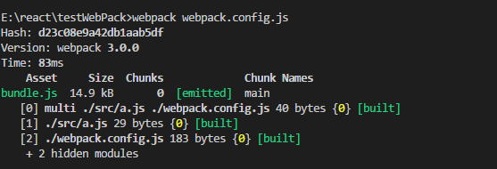
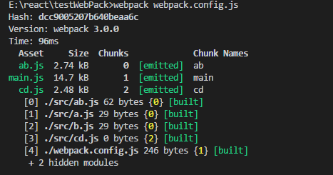
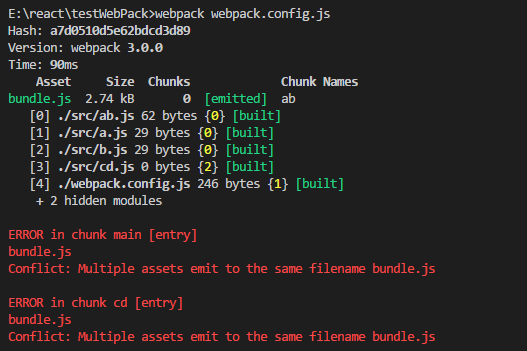
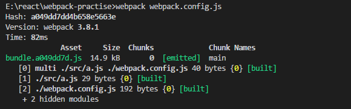

## webpack单入口

- 默认输出到dist目录下面的是bundle.js

```
module.exports = {
  entry: path.join(__dirname, './src/a.js'),
  output: {
    filename: 'bundle.js',
    path: path.join(__dirname, 'dist')
  }
}
```


## webpack 多入口文件

- 默认输出到dist目录下面的是main.js

```
module.exports = {
  entry: {
    ab: path.join(__dirname, './src/ab.js'),
    cd: path.join(__dirname, './src/cd.js')
  },
  output: {
    filename: '[name].js',
    path: path.join(__dirname, 'dist')
  }
}
```



## 多入口文件不能指定具体的输出名称
 
```
module.exports = {
  entry: {
    ab: path.join(__dirname, './src/ab.js'),
    cd: path.join(__dirname, './src/cd.js')
  },
  output: {
    filename: 'bundle.js',
    path: path.join(__dirname, 'dist')
  }
}
```
会提示错误： Conflict: Multiple assets emit to the same filename ab.js


## hash、chunkhash与contenthash 与缓存

1. 为什么需要缓存？

首先让我们看看webpakc官方文档

```
只要 /dist 目录中的内容部署到服务器上，客户端（通常是浏览器）就能够访问网站此服务器的网站及其资源。而最后一步获取资源是比较耗费时间的，这就是为什么浏览器使用一种名为缓存的技术。可以通过命中缓存，以降低网络流量，使网站加载速度更快，然而，如果我们在部署新版本时不更改资源的文件名，浏览器可能会认为它没有被更新，就会使用它的缓存版本。由于缓存的存在，当你需要获取新的代码时，就会显得很棘手。
```

也就是说，通过命中缓存可以使得网站的加载速度更快。但是， 如果我们更改了某个js文件中的一行代码却没有给这个js文件改名时，浏览器人仍然会命中缓存，导致页面无法及时更新。这时候hash和chunkhash这种文件指纹就排上用场了。hash会针对每次代码更改给文件名后缀加上一串独一无二的hash串来保证浏览器不命中缓存。

2. 如何使用

- hash
```
let path = require('path')

module.exports = {
  entry: path.join(__dirname, './src/a.js'),
  output: {
    filename: 'bundle.[hash:8].js',
    path: path.join(__dirname, 'dist')
  }
}
```
- chunkhash



```
let path = require('path')

module.exports = {
  entry: path.join(__dirname, './src/a.js'),
  output: {
    filename: 'bundle.[chunkhash:8].js',
    path: path.join(__dirname, 'dist')
  }
}
```


3. hash和chunkhash的区别

还是从文档入手，看看他们的定义：

```
[hash] is replaced by the hash of the compilation.
hash 是编译的hash值
```
问题又来了， 什么是compilation, 继续看文档：
```
A compilation object represents a single build of versioned assets. While running Webpack development middleware, a new compilation will be created each time a file change is detected, thus generating a new set of compiled assets. A compilation surfaces information about the present state of module resources, compiled assets, changed files, and watched dependencies.

compilation对象代表某个版本的资源对应的编译进程。当使用Webpack的development中间件时，每次检测到项目文件有改动就会创建一个compilation，进而能够针对改动生产全新的编译文件。compilation对象包含当前模块资源、待编译文件、有改动的文件和监听依赖的所有信息。
```

与compilation对应的有个compiler对象，通过对比，可以帮助大家对compilation有更深入的理解。

```
The compiler object represents the fully configured Webpack environment. This object is built once upon starting Webpack, and is configured with all operational settings including options, loaders, and plugins.

compiler对象代表的是配置完备的Webpack环境。 compiler对象只在Webpack启动时构建一次，由Webpack组合所有的配置项构建生成。
```

简单的讲，compiler对象代表的是不变的webpack环境，是针对webpack的；而compilation对象针对的是随时可变的项目文件，只要文件有改动，compilation就会被重新创建。

```
[chunkhash] is replaced by the hash of the chunk.
chunkhash是chunk的hash值
```
参考链接

[Webpack中hash与chunkhash的区别，以及js与css的hash指纹解耦方案](URL 'https://www.cnblogs.com/ihardcoder/p/5623411.html')

[webpack中的hash、chunkhash、contenthash区别](URL 'https://juejin.im/post/5a4502be6fb9a0450d1162ed')