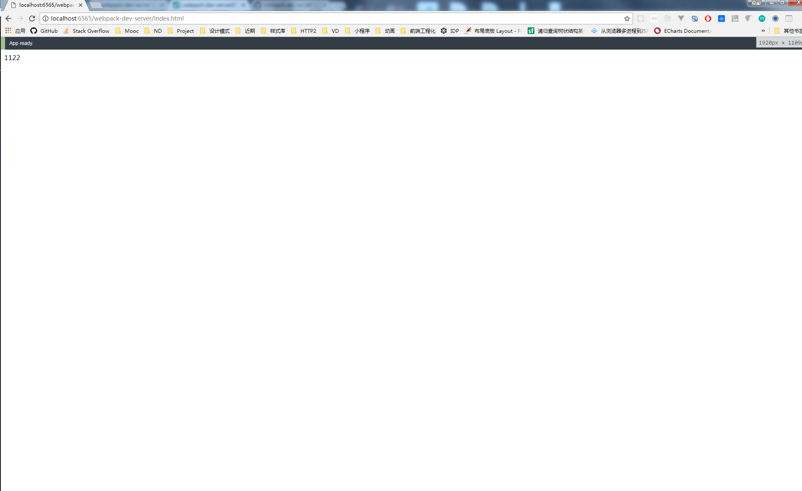

## webpack-dev-server的自动刷新和模块热替换机制

从外部看表现为自动刷新，
从内部的角度来看表现为模块热替换（既只对发生变化的模块进行替换）

webpack-dev-server自动刷新和模块刷新的实现方式
- Iframe mode(默认情况下)

特点
1. 在网页中嵌入了一个iframe，将我们自己的应用注入到这个iframe当中去。
1. 在页面头部有一个提示框，用于显示构建过程的状态信息。
1. 加载了live.bundle.js文件，其不但创建了iframe标签，同时包含socket.io的client代码，以和webpack-dev-server进行websocket通讯，从而完成自动编译打包、页面自动刷新的功能。

页面被嵌在一个iframe中，在模块变化的时候重载页面



原理
当使用Iframe mode时，请求/webpack-dev-server/index.html路径时，会返回client/index.html文件，这个文件的内容就是：

```
<!DOCTYPE html>
<html>
    <head>
        <meta http-equiv="X-UA-Compatible" content="IE=edge"/>
        <meta charset="utf-8"/>
        <meta name="viewport" content="width=device-width, height=device-height, initial-scale=1.0, user-scalable=no, minimum-scale=1.0, maximum-scale=1.0"/>
        <script type="text/javascript" charset="utf-8" src="/__webpack_dev_server__/live.bundle.js"></script>
    </head>
    <body></body>
</html>
```

可看出，这个页面会请求live.bundle.js文件,该文件里面会新建一个Iframe，你的应用就被注入到了这个Iframe当中。

同时live.bundle.js中含有socket.io的client代码，这样它就能和webpack-dev-server建立的http server进行websocket通讯了。并根据返回的信息完成相应的动作。

访问路径

- inline mode(需要配置) 添加到bundle中

特点
1. 构建消息在浏览器控制台显示。
1. socket.io的client代码被打包进了你的包(bundle)中，以此来与webpack-dev-server进行websocket通讯，从而完成自动编译打包、页面自动刷新的功能。
1. 但是，每一个入口文件都会被插入上述的一段脚本，使得打包后的bundle文件很臃肿。
使用inline mode的时候，这个时候访问的路径是:
```
localhost:8080/index.html
```

Inline mode也能完成自动编译打包、页面自动刷新的功能，但是页面没有header部分的reload消息的显示，不过在控制台中会显示reload的状态。

原理
Inline-mode，是webpack-dev-server会在你的webpack.config.js的入口配置文件中再添加一个入口,

```
 module.exports = {
        entry: {
            app: [
                'webpack-dev-server/client?http://localhost:8080/',
                './src/js/index.js'
            ]
        },
        output: {
            path: './dist/js',
            filename: 'bundle.js'
        }
    }
```
这样就完成了将inlined.js打包进bundle.js里的功能，同时inlined.js里面也包含了socket.io的client代码，可以和webpack-dev-server进行websocket通讯。

当然你也可以直接在你index.html引入这部分代码:
```
<script src="http://localhost:8080/webpack-dev-server.js"></script>
```

### 总结
1. Iframe mode和Inline mode最后达到的效果都是一样的，都是监听文件的变化，然后再将编译后的文件推送到前端，完成页面的reload的。
1. 通过设置devServer.inline切换两种模式，默认为inline模式。
1. 当使用HMR功能时，推荐使用inline mode。

注意： HMR不能和chunkhash一起使用， 否则会报错
```
Cannot use [chunkhash] for chunk in '/dist/js/[name]_[chunkhash].js' (use [hash]
```
解决方法：
1. 在使用脚本开启检测scripts命令， 如果是开发环境就更改文件的名称，使用[name]-[hash]